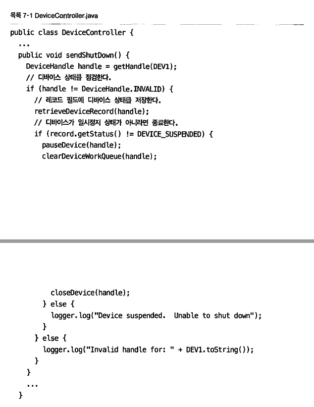
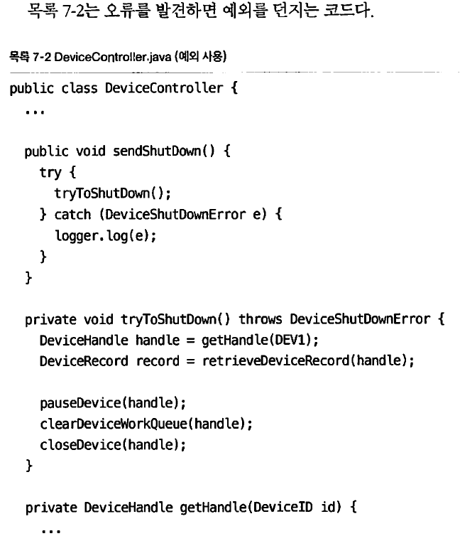
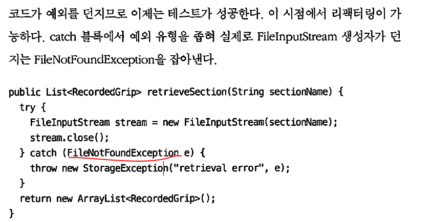
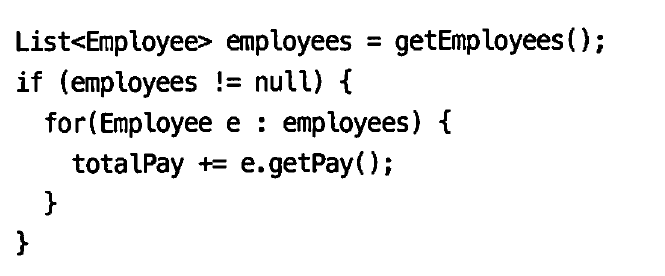
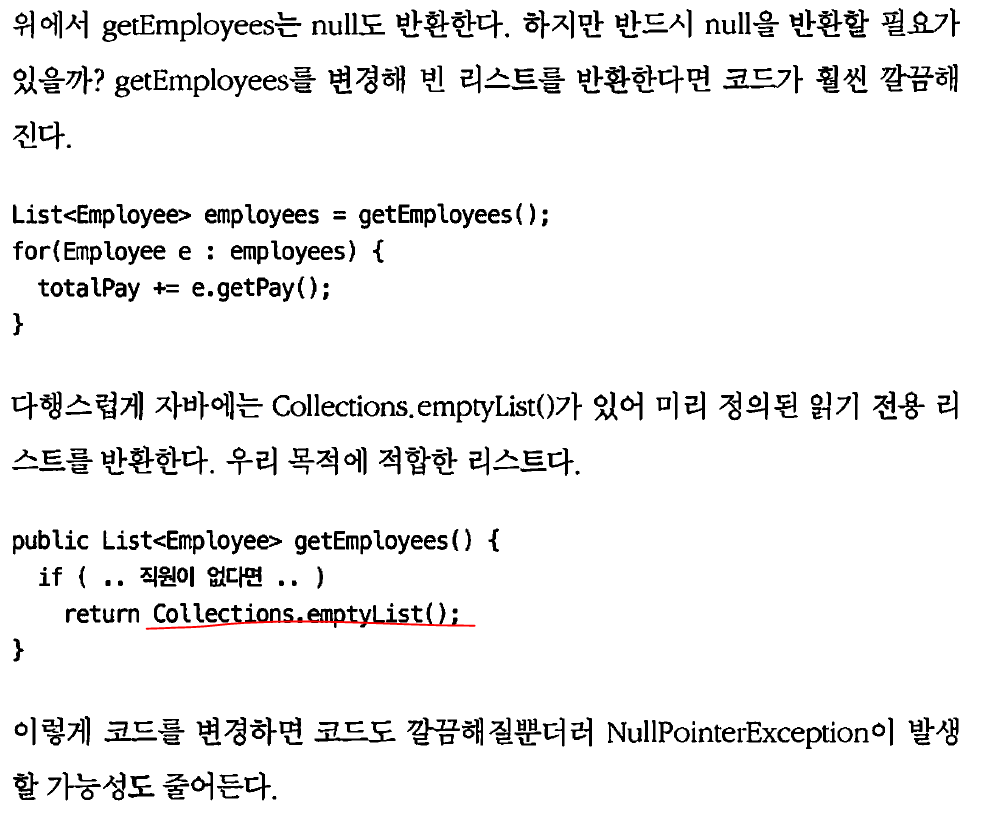
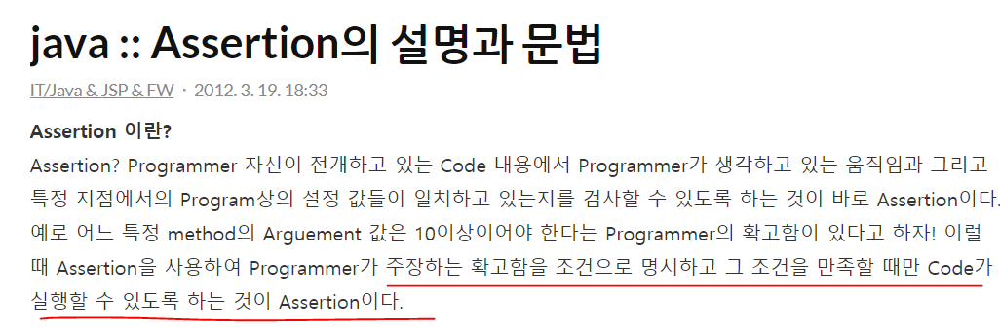
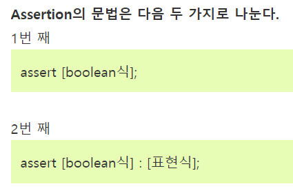

### 예외처리

예외처리

- 예외처리의 원칙 
1. 적절하게 복구 
2. 작업 중단하고 개발자에게 알리기 by toby

- 오류 처리는 중요하다.
  - 하지만 오류 처리 코드로 인해 프로그램 논리를 이해하기 어려워진다면 깨끗한 코드라 부르기 어렵다
    - ex. 이런 식의 코드는 지저분하다
    - 이유 : 오류 발생 시 바로 확인 안하면, 걍 넘어감
    - 
    - 다음은 오류를 발견하면 예외를 던지는 코드임
    - 

훨씬나음

- try catch 블록을 사용하라
  - try 블록에서 무슨 일이 생기든지 catch 블록은 프로그램 상태를 일관성 있게 유지해야함
  - 그니까 try catch 문에서 분기를 만들지 말아라…라는뜻!
  - 

이 것처럼 catch에 exception 종류를 나눠서 사용해서 어떤 exception이 났는지 파악할 것, TDD를 사용해 강제로 예외를 일으키는 테스트케이스 작성 후 테스트를 통과하는 코드를 만들 것

- Q. 확인된 예외의 장단점???
  - 확인된 예외 : 내가 경우의 수로 생각하고 처리해놓은 예외들
  - 근데 이 확인된 예외들의 문제점은 만약에 하위함수인 예외처리 로직에서 추가를 할 경우에, 상위의 함수에 
    - catch 블록에서 새로운 예외를 처리하거나
    - 선언부에 throw 절을 추가해야 한다.

직접적인 모듈의 수정이 아닌데도 확인하는 예외처리 때문에 빌드를 다시하고 재배포 해야함, 그리고 이거는 throws 경로에 위치하는 모든 함수가 최하위 함수를 알아야 하므로 캡슐화가 깨진다고 함. 그리고 이게 번거롭다는거임
	근데 이게 번거로우면 안되는 거 아닌가..? 그럼 sw에 문제가 있다는건데
	그래서 확인된 예외도 중요하지만,, 그걸 하나씩 잡다보면 너무나 의존성이 높아져서(캡슐화가 깨짐) 이것도 문제임.. 흠.
따라서 미확인 에러를 사용하라  근데 어떻게 사용하라는 건지..?

- **결론** 
```
public void test(){} 이렇게 있고 안에 try catch 하면 상관 없지만
public void test() throw Exception{} 하면 이거 쓰는 모든 함수에서
throw Exception{}를 더하라고 에러로 뜨기 때문에 전체를 수정해야 함 따라서 
throw Exception{}를 안쓰는게 좋다
```

- 예외 던질 시 실패한 연산 이름과 실패 유형도 언급하여 던진다 그래야 기록이 남음
  - 모든 예외처리를catch로 한번씩 잡는 건 형편없는 코드

ex.
외부 api를 받아오는 곳이라면, 내코드랑 합하고 나서 예외처리를 하지 말고, 외부 api를 바로 감싸버려서(try catch) 외부에서 문제면 바로 알수 있게 하기

- 오류감지?
  - 특수 사례 패턴 : 클래스를 만들거나 객체를 조작해 특수 사례를 처리하는 방식

- 예외를 캐치해서 연산을 하고 있는게 문제임, try는 진짜 예외처리를 할 때 사용 해야 하고,
  - 이거는 단순 계산할 때 사용하는 거기 때문에 문제가 되는 코드임 그리고 외부 api의 오류를 받아서 내가 가지고 있는 exception으로 바꿔서 던져주는 것임


- null을 반환하지 말라 null반환이 제일 나쁜코드임
  - 만약 null을 반환하고 싶다면? 	예외를 던지거나, 특수사례객체를 던저라
  - ex. 
  - 
 이코드를 바꾸면 


 이렇게됨 대박 난 왜 몰랐을까

- **7장 140 page이거는 꼭 잘봐둬야함 내가 잘못하는거임**

- assert
  - assert는 조건이 필요한 에러 / throw는 조건 없이 다 던지는 에러

 


  이렇게 사용
null을 넘기는건.. 그냥 무조건 좋은 방법이 아니다. 따라서 그냥 null자체를 반환하지 않게 만들어라

- 혹시 nullable을 확인하려면 Optional을 사용하라

